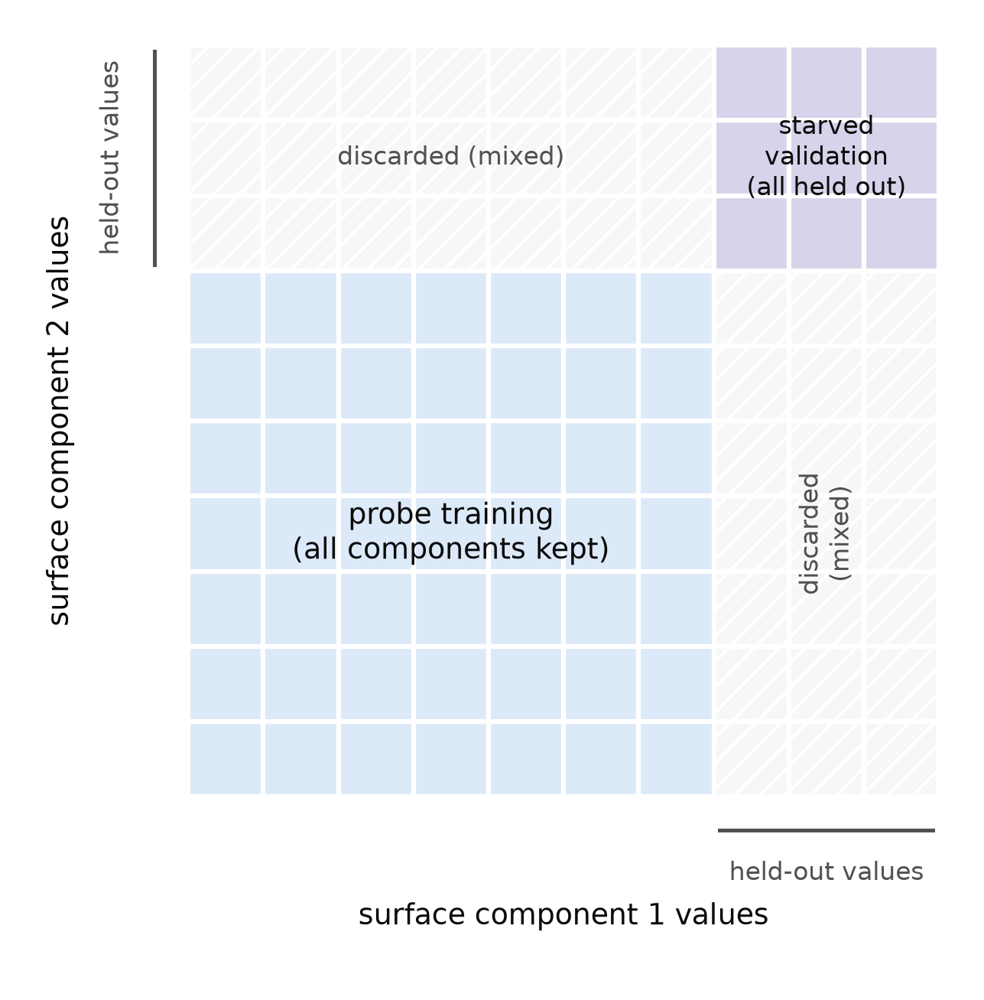
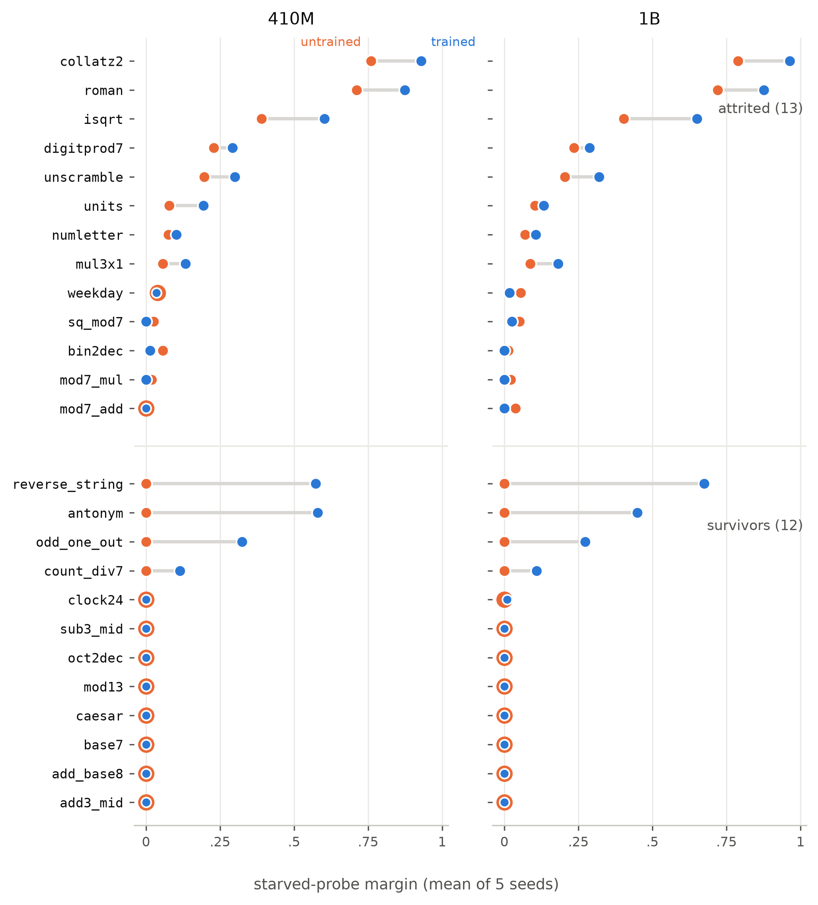
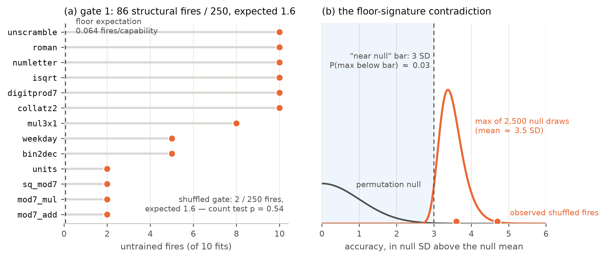

# Decodable Is Not Learned: Untrained-Weights Controls and Basis-Starved Splits for Linear Probing

**Author:** Michael Jordan
*Complete first draft, all sections reviewed by Michael 2026-07-27.
Figures 1–3 and Table 1 are generated by committed scripts in
`paper/` (fig1_schematic.py, fig2_plot.py, fig3_gates.py,
table1_data.py); the appendices are pending. Figures F1–F3 and Table T1 not
yet placed. Every number is transcribed from the tagged record
(`exp2-preregistered`, `exp2-closed`, `exp2b-preregistered`,
`exp2b-closed`) or from `paper/fig2_data.json`, which recomputes from
the committed fit files; every citation is verified against arXiv or
the publisher's record before it enters the text.*

## Abstract

A linear probe that clears significance is routinely read as evidence
that a model has learned, represents, or is developing a capability.
The inference is unsound: a network's activations are a
high-dimensional expansion of the visible tokens, and a linear readout
on such an expansion decodes many functions of the input that training
never put there. This paper prescribes three controls that make the
inference testable — an untrained-weights twin of the model run through
the identical probe pipeline as an acceptance test; basis-starved
splits, whose validation items share no surface-component values with
probe training; and tolerances calibrated from the mechanism that
generates each control's events rather than set to zero — and reports
two preregistered probing campaigns that the controls terminated before
any outcome measurement. In the first, the untrained twin fired on 120
of 120 fits: under standard splits, probe significance measured
reservoir decodability, not learning. In the second, starving closed
the lookup class and the untrained twin exposed a class beneath it: 13
of 25 capabilities decodable from untrained weights at margins of .06
to .82, reproducing across independent initializations, via surface
statistics that no value holdout can remove. The screen is passable:
the twelve surviving capabilities read exactly zero untrained margin
in every cell, and string reversal's untrained readout, which fired
under standard splits, fell to zero under starving while the trained
margin held. A taxonomy of the leak mechanisms and a checklist
written for verbatim adoption distill the record.

## 1. The problem and the prescription

A linear probe reads a label off a network's activations, clears a
significance test, and the paper concludes the model represents the
property. The step from "a readout can be fit" to "the model learned
something" is taken silently in most probing work, and it isn't sound.
A transformer's activations at any layer are, among other things, a
high-dimensional nonlinear expansion of the visible tokens, and an
expansion like that supports linear readouts of many functions of the
input that no training ever put there. Random-feature regression and
reservoir computing are whole method families built on exactly this
capacity of untrained networks; Section 2 gives the arithmetic. The
fraction of probe signal that comes free with the architecture is not
small and not exotic: in the experiments reported here, an untrained
network cleared the same significance tests as the trained one on
every capability in a twelve-task battery.

The prescription is short enough to state completely on page one.

- **P1. The untrained twin as an acceptance test.** Run the identical
  probe pipeline (same architecture, tokenizer, prompts, extraction
  points, splits, and statistics) on a twin of the model with weights
  at seeded random initialization. Capability-precursor claims stand
  only on the trained-minus-untrained gap. The screen belongs at
  inclusion time, before a capability enters the battery; the
  campaigns reported here ran it post hoc and spent both batteries
  learning where it belongs.
- **P2. Basis-starved splits.** Wherever the label could be looked up
  from surface components of the prompt, name those components against
  the tokenizer's actual token inventory, then validate only on items
  whose every component value was held out of probe training,
  discarding items that mix held-out and kept values.
- **P3. Mechanism-calibrated tolerances.** Every control gets a
  tolerance derived from the mechanism that generates its events: no
  zero-tolerance rules on tests with designed nonzero rates, and
  per-fire signature bars from the order statistics of the permutation
  null (the expected maximum of N permuted fits), not from SD
  intuitions.

The evidence is two preregistered probing campaigns, both ended by
these controls before either touched its outcome variable. In the
first, the untrained control fired on 120 of 120 fits, each at the
permutation floor, across every capability: standard train-validation
splits let a linear readout assemble lookup tables in the random
expansion, and diagnostics showed the trained probes' ceiling margins
were lookup too. In the second, splits starved by design closed that
class (the prior campaign's proven offender fell from margin 1.0 to
about 0.1 untrained), and the untrained control then exposed a second
class underneath: 86 of 250 untrained fits fired structurally, on
thirteen of twenty-five capabilities, at margins from .06 to .82 that
reproduce across two independently initialized models — labels
partially computable from surface statistics that no holdout of basis
values can remove. Both experiments returned INSUFFICIENT_DATA under
their frozen rules. The deaths are the point: every failure was a
detection, and every verdict was projected in a timestamped ledger
before the frozen adjudication ran.

The paper contributes, in order of expected reuse: an operational
checklist for probing hygiene written for verbatim adoption (Table T2,
Section 8); a taxonomy of surface-computability leaks, with
per-capability anatomy and the trained-versus-untrained comparison
that separates rescuable tasks from surface-all-the-way-down ones
(Section 5); the starved-probe instrument, its calibrated gates, and
its determinism infrastructure (Section 3); the two campaign records
as worked examples of the controls operating under preregistration
discipline (Section 4); and three calibration rules for frozen
criteria, learned from defects in my own frozen code and promoted to
standing practice (Section 6).

## 2. Background

Linear probing entered the field as a diagnostic: fit a linear
classifier on frozen intermediate activations and read its accuracy as
evidence about what the network represents (Alain and Bengio, 2016).
The trouble with that reading was noticed early, and the critique
literature that followed is, in most of its branches, a series of
constraints on the probe. Hewitt and Liang (2019) showed that an
expressive probe can score well by learning the task itself rather than
reading it out, and proposed control tasks: the same probe fit against
randomized word-to-label mappings, with selectivity, the gap between
task and control accuracy, as the honest report. Voita and Titov (2020)
replaced accuracy with description length, separating a probe that
finds structure cheaply from one that grinds it out of raw material.
Elazar, Ravfogel, Jacovi, and Goldberg (2020) moved the question from
decodability to use: erase the property from the representation and
watch whether the model's behavior degrades. Belinkov's (2021) survey
organizes the field around this family of worries. What the branches
share is their target. Control tasks bound what the probe could learn
from anything; description length prices the probe's effort; amnesic
probing asks whether the model rather than the probe depends on the
property. All of them interrogate the probe's expressivity. None of
them interrogates the substrate's: what a linear readout can extract
from this architecture before training has shaped a single weight.

Untrained networks as comparison points do appear in the literature.
Zhang and Bowman (2018) reported that randomly initialized, frozen
encoders retain much of the probing signal trained ones show, an effect
that vanished only when the probes' training data was cut. Wieting and
Kiela (2019) found random-projection sentence encoders close enough to
trained ones on standard classification benchmarks to recommend them as
mandatory baselines. But the untrained network has lived as a row in a
table: a number the headline result should exceed, compared informally,
with nothing decided when the comparison comes out badly. The
prescription in this paper is that row promoted to an acceptance test.
The untrained twin runs the identical pipeline (same prompts, splits,
candidate sweep, permutation null, and correction), its tolerated fire
count is derived from the pipeline's own false-positive arithmetic, and
battery membership is decided by the outcome. The distinction from
control tasks is worth stating exactly: a control task randomizes the
labels and keeps the trained representation, measuring what the probe
could do with anything; the untrained control keeps the true labels and
randomizes the representation, measuring what this architecture gives
away for free. Section 4 shows the two catch different failures, and
that the informal version of the comparison saturates precisely where
it's needed most.

There's nothing mysterious about a random network that computes; an
engineering field is built on it. Reservoir computing treats a fixed
random recurrent network as a high-dimensional expansion of its input
stream and trains only a linear readout, on the explicit design premise
that random dynamics furnish a feature basis for free (Jaeger, 2001;
Maass, Natschläger, and Markram, 2002). Rahimi and Recht (2007)
supplied the feedforward theory: linear fits on random nonlinear
projections approximate kernel machines. Cover (1965) supplied the
arithmetic that says when to worry: a linear separator with d degrees
of freedom has a separating capacity of about 2d points in general
position. The probes in Sections 4 and 5 fit on the order of 1,500
training rows against hidden widths of 1,024 at 410M and 2,048 at 1B —
at or under capacity, where a clean training fit is free and means
nothing. Everything rests on validation, and validation is where the
reservoir property bites: a readout generalizes whenever the label is a
simple enough function of surface features that the random expansion
preserves them. A probing study at these scales that skips the
comparison is asserting that its accuracy came from learning while
standing on a substrate the reservoir literature would use as shipped.

The batteries these controls were built for served a measurement
program adjacent to the emergence debate. Wei et al. (2022) called an
ability emergent when smaller models lack it and larger ones have it;
Schaeffer, Miranda, and Koyejo (2023) argued that much of the apparent
discontinuity is manufactured by discontinuous metrics. One way to
press on that dispute is to look below threshold with something sharper
than a benchmark: if linear-probe margins at 410M and 1B forecast which
capabilities later appear up the Pythia ladder (Biderman et al., 2023),
the capability was developing smoothly before the benchmark could see
it. This paper argues neither side of that question and contributes no
evidence to it; both campaigns closed before any outcome variable was
measured. What the program contributed here is discipline. Probe
readings meant as forecasts had to be committed before the forecasted
models were queried, so no outcome data existed to sanity-check the
probes against, and the controls of Section 3 had to carry the whole
burden of trust. The methods in this paper are what that constraint
produced, and they stand or fall independent of the program that
motivated them.

## 3. The instrument

The instrument is a linear probe with its evaluation moved onto ground
the confound can't reach. This section describes it as frozen for
Experiment 2b; everything here was committed and tagged before the
campaign produced data.

The probe machinery is one experiment older than the campaigns of
Section 4. Experiment 1 validated the instrument class on synthetic
ground truth: small transformers trained from scratch on tasks where
the presence or absence of the capability was known by construction,
including percolation-style cells engineered to have no structure
below threshold. The permutation-null probe module frozen there is
the one Experiments 2 and 2b inherit, and its closeout also supplied
the first entry in Section 6's catalog of frozen-criterion defects — a
magnitude criterion misspecified across incomparable chance floors,
ledgered as such and left to stand.

**Targets and items.** Each capability contributes about 2,000 probe
items: a prompt, the model's hidden states over that prompt, and a probe
label defined by the capability's specification. The label is never the
free-form answer; it's a small-alphabet function of the answer chosen at
design time (the ones digit of the root, the first letter of the
solution, the power of ten), which keeps probe classes balanced enough
to test and forces every capability's specification to say exactly what
the probe is supposed to find. A specification must declare five things
before an item is generated: the probe target, the surface basis, the
starving split with a feasibility count, an oracle, and a
dumbest-baseline analysis stating what a lookup table or a random
network should score. Capabilities that can't fill in those fields
honestly don't enter the battery. Table 1 lists the scored battery in
full.

**The probe.** Activations are harvested at two fixed token positions
per layer (position 0 is the question-end token), with layers thinned to
every third plus the final one: nine layer positions at 410M and seven
at 1B, so a capability's fit sweeps a family of 18 or 14
(layer, position) candidates. Each candidate is a standard pipeline, a
scaler and a logistic regression (C = 1.0, 100 iterations) fit on probe
training rows and scored as accuracy on the starved validation rows,
with the scaler fit inside the split. Significance comes from a
permutation null: 2,500 label permutations over all items under the
fixed split, refitting the probe each time, which under the null of no
activation-label association is exact regardless of the split's
structure, because a lookup strategy is starved in the observed fit and
in every permuted fit alike. The best candidate's p-value is Bonferroni
corrected for the family, a capability reads "present" when the
corrected p clears .01, and the reported effect size is the margin,
accuracy relative to the null mean rescaled to the interval up to 1,
zeroed when the significance bar isn't met. The add-one permutation
floor fixes the smallest achievable corrected p at 18/2501 ≈ .0072 for
410M and 14/2501 ≈ .0056 for 1B; those two constants generate all the
gate arithmetic below.

**The basis and the starving split.** The basis is the construction that
distinguishes this instrument from a standard probe. For each
capability, the specification names the tuple of surface components a
lookup strategy would key on, analyzed against the tokenizer rather than
against human intuition about the task. Experiment 2's addition lesson
is the reason for that clause: Pythia's BPE splits numbers into digit
chunks, so an operand-level basis under-specifies what the readout can
key on for any digit-local label, and digit-local targets are banned at
design time rather than starved badly. Given the basis, a starving
split draws a held-out value set per component. Validation items are
those whose components are all held out; training items those whose
components are all kept; items mixing the two are discarded from the
fit entirely (Figure 1). A readout keyed on any component therefore meets only
unseen values at validation and scores chance by construction, and the
same holds for additive combinations of per-component scores. Splits
must hold out at least 15 values per component, produce at least 300
validation items, and keep every probe class present on both sides,
enforced by seeded rejection with a bounded number of redraws; each of
the five probe seeds redraws which values are held out, so a
capability's five fits starve five different corners of its basis. Two
variants cover geometries the plain construction handles badly: when
components share one value space, a single holdout set drawn from the
union applies to every position, closing the leak where a value held
out at one position remains learnable at another; and when the label is
a function of the basis value with rare classes, the holdout is drawn
proportionally within label groups, which is what keeps rare classes on
both sides of the split. Capabilities that can't satisfy the
constraints for all five seeds are ejected before the freeze, with the
failure recorded; five candidates died that way, including one whose
entire item space was smaller than the permutation count.

*Figure 1. The basis-starved split. Items live on the grid of
surface-component values. Probe training uses only items whose
components are all kept; validation only those whose components are
all held out; mixed items are discarded. A readout keyed on any
component meets only unseen values at validation and scores chance by
construction.*

**The gates.** Four controls surround the scored fits, each with its
tolerance derived from the floor arithmetic rather than set by feel.
The untrained-weights gate runs the identical pipeline, splits and all,
on a twin of each model with weights at seeded random initialization
and nothing else changed. Its expected clean-machinery fire count is
the number of fits times the family-adjusted floor rate, about 1.6
fires across this campaign's 250 untrained fits, and the gate tests the
observed count against that rate binomially instead of demanding zero.
Fires that are structurally above the floor mark real leaks: the
capability is dropped, and the experiment's own rules decide whether
enough battery survives to continue (the floor here was twenty of
twenty-five; Section 4 records the outcome, and Section 6 records what
the closeout found wrong with the per-fire classification rule as
frozen). The shuffled-label gate refits trained activations against
labels permuted by a seeded generator, using the same split geometry as
the real fits and permuting only the fit labels (the ordering as
corrected mid-campaign; Section 4.2 discloses the original defect); it
carries the same binomial tolerance, and a structurally-above fire there is grounds for
declaring the pipeline itself unsound. The known-present gate points
the instrument at capabilities that plainly exist (an entity-tracking
task and a copy control) and requires seed-majority detection at both
sizes with a mean starved margin of at least 0.2 at 1B, on the argument
that an instrument that can't see what's there has no business ruling
on what isn't. And an argmax gate requires the copy control to be
generated correctly greedily at least 90% of the time at both probe
sizes, certifying the generation-side harness that the battery's
inclusion decisions depend on.

**Determinism.** Because probe fits were distributed across three
machines with three BLAS stacks, a box's results counted only after it
reproduced a reference fixture through the real probe path bit for bit,
prediction counts and all, against the Mac-computed reference. The rule
was reproduce-or-be-excluded, with no debugging tier in between; in the
event, arm64 Accelerate, x86-64 OpenBLAS, and Windows all matched
exactly under single-threaded BLAS, and the campaign's 770 fits merge
idempotently from any box that passed. I mention the infrastructure not
as engineering color but because it's part of the claim: every number
in Sections 4 and 5 recomputes from committed fit files, and the fits
themselves don't depend on which machine produced them.

*Table 1. The scored battery as frozen (n = 25), grouped by gate-1
fate: task, probe label, surface basis, and starving-split parameters.
Held-out counts are over the values observed in the item pool and are
means across the five probe seeds, as are the validation / training /
discarded item counts. Three basis descriptions are abridged from the
committed specification strings (the mapping is in
`paper/table1_data.py`); the item files carry the verbatim text.*

| capability | task | probe label | surface basis | split (held-out / observed values) | val / train / disc. | fate |
|---|---|---|---|---|---|---|
| bin2dec | binary to decimal, 8-12 bits | value mod 10 (0-9) | bit-string (3968 significant 8-12-bit strings) | 0.2 → 400/2,000 | 400 / 1,600 / 0 | attrited |
| collatz2 | two Collatz steps | ones digit of the FIRST-step result (0-9) | N token (~9990 values) | 0.2 → 400/2,000 | 400 / 1,600 / 0 | attrited |
| digitprod7 | product of 4 digits (1-9), mod 7 | the product mod 7 (0-6) | the number token (9^4 = 6561 values) | 0.2 → 400/2,000 | 400 / 1,600 / 0 | attrited |
| isqrt | integer square root of N (100-9999) | ones digit of the root (0-9) | N token (~9900 values) | 0.2 → 400/2,000 | 400 / 1,600 / 0 | attrited |
| mod7_add | (a+b) mod 7, 2-digit operands | a mod 7 (0-6) | first operand token (90 values) | 0.2 → 18/90 | 400 / 1,600 / 0 | attrited |
| mod7_mul | (a*b) mod 7, 2-digit operands | a mod 7 (0-6) | first operand token (90 values) | 0.2 → 18/90 | 396 / 1,604 / 0 | attrited |
| mul3x1 | 3-digit x 1-digit multiplication | tens digit of the product (0-9) | the 3-digit operand token (900 values) | 0.2 → 167/835 | 392 / 1,608 / 0 | attrited |
| numletter | (N x alphabet position) mod 26 | the result (0-25) | N token (990 values); letters all seen | 0.2 → 174/867 | 402 / 1,598 / 0 | attrited |
| roman | roman numeral addition (values 1-99) | first numeral's value mod 10 (0-9) | first numeral string (99 values) | 0.2 → 20/99 | 400 / 1,600 / 0 | attrited |
| sq_mod7 | (a^2 + b) mod 7, 2-digit operands | a^2 mod 7 (quadratic residues: 0, 1, 2, 4) | the squared operand token (90 values) | 0.2 → 18/90 | 403 / 1,597 / 0 | attrited |
| units | metric conversion (power 1-3) | power of 10 (1-3) | unit pair (16 values; design's 3/16 holdout overrides the 15-value minimum) | 0.2 → 3/16 | 378 / 1,622 / 0 | attrited |
| unscramble | unscramble a 5-6 letter word | first letter of the solution | the solution word (multiset-unique pool) | 0.2 → 150/736 | 407 / 1,593 / 0 | attrited |
| weekday | day-of-week offset, N <= 499 | N mod 7 (0-6) | offset token N (~499 values) | 0.2 → 100/497 | 403 / 1,597 / 0 | attrited |
| add3_mid | 3-digit addition | middle digit of the sum (0-9) | tens-digit pair (100 values) | 0.2 → 20/100 | 413 / 1,587 / 0 | survivor |
| add_base8 | octal addition, 2-digit operands | ones digit of the octal sum (0-7) | ones-digit pair in base 8 (64 values) | 0.2 → 13/64 | 409 / 1,591 / 0 | survivor |
| antonym | which option is the opposite of the cue | answer position (1-4) | the cue word (the cue-answer association is the lookup) | 0.2 → 24/117 | 408 / 1,592 / 0 | survivor |
| base7 | write N in base 7 | N mod 7 (0-6, the last digit) | N token (~9990 values) | 0.2 → 400/2,000 | 400 / 1,600 / 0 | survivor |
| caesar | decode a Caesar shift (k stated, 1-5) | first letter of the decoded word | (first cipher letter, shift) combo (~130 values) | 0.2 → 44/110 | 795 / 1,205 / 0 | survivor |
| clock24 | 24-hour clock, +D hours (D 25-499) | (H+D) mod 24 (0-23) | offset token D (475 values); mod-of-offset sibling of weekday | 0.2 → 95/471 | 405 / 1,595 / 0 | survivor |
| count_div7 | count of multiples of 7 in [a, b] | the count (~4-18) | both endpoint tokens (shared value space) | 0.45 → 446/882; 446/934 | 824 / 1,201 / 1,975 | survivor |
| mod13 | (a+b) mod 13, 3-digit operands | a mod 13 (0-12) | first operand token (900 values) | 0.2 → 164/817 | 391 / 1,609 / 0 | survivor |
| oct2dec | octal to decimal, 3-4 octal digits | value mod 10 (0-9) | octal string (4,032 values); value-mod-10 sibling of bin2dec | 0.2 → 400/2,000 | 400 / 1,600 / 0 | survivor |
| odd_one_out | which of 4 words is not like the others | answer position (1-4) | all 4 words (shared components over the category vocab) | 0.45 → 72/130; 72/149; 72/151; 72/136 | 338 / 741 / 6,921 | survivor |
| reverse_string | reverse a random 4-6 letter string | last letter of the input (26) | final BPE chunk of the input (chunks, not strings, are the lookup unit) | 0.2 → 130/650 | 408 / 1,592 / 0 | survivor |
| sub3_mid | 3-digit subtraction (non-negative) | middle digit of the difference (0-9) | tens-digit pair (100 values) | 0.2 → 20/100 | 408 / 1,592 / 0 | survivor |

## 4. Two preregistered stress tests

The evidence for the prescription isn't a benchmark built to flatter it.
It's two preregistered experiments that the controls killed, in sequence,
for different reasons, before either one was allowed to touch its outcome
variable. Both designs were frozen and tagged before any data existed;
both adjudications ran as committed code against written rules; both
verdicts were projected in a timestamped ledger before the formal report
executed. The full record, including every number below, is in the tagged
repository history.

Both experiments serve a larger program that asks whether linear-probe
margins at small scale forecast which capabilities later emerge up a model
ladder. That question imposes an unusual discipline: probe results at
410M and 1B parameters had to be committed before any larger model was
queried, so the probe instrument had to be trustworthy on its own, with no
outcome data available to rescue it. The controls below exist because of
that constraint. Neither experiment ever queried the larger models. The
program's question remains open, and this paper makes no claim about it.

### 4.1 Experiment 2: standard splits, and what a random network decodes

The first experiment probed twelve capabilities on Pythia at 410M and 1B:
modular arithmetic, two- and three-digit addition, two-digit
multiplication, roman numeral conversion, weekday offsets, unit
conversion, string reversal, unscramble, acronym formation, category
counting, and a substitution cipher. Roughly
two thousand probe items per capability; linear probes swept over
(layer, token) candidates against a 2,500-draw permutation null with a
Bonferroni family correction; five probe seeds per cell. The design
included the control this paper argues for: the identical pipeline run on
an untrained twin of each model, same architecture and tokenizer, weights
at seeded random initialization. What it lacked was any defense in the
split. Probe train and validation rows were drawn from the same item pool
the standard way, stratified but otherwise random.

The untrained control fired on everything. All twelve capabilities, both
sizes, every seed: 120 of 120 fits significant, each at the
family-corrected permutation floor (p = 18/2501 ≈ .0072, meaning the
observed accuracy beat all 2,500 label permutations). These weren't
marginal detections. At 410M, seed-0 margins were 1.000 for unit
conversion and mod-7 arithmetic, 0.992 for two-digit addition, 0.982 for
roman numerals, 0.970 for weekday offsets; the weakest, the cipher, still
cleared 0.205 against its own null. Replication at 1B fired 60 of 60 with
near-identical margins, and the letter tasks got stronger (acronym 0.262
to 0.345, reversal 0.350 to 0.390): doubling the width hands the linear
readout twice the random features, so the bigger probe-side model deepens
the confound instead of escaping it.

The mechanism is what the reservoir-computing literature would predict. A
fixed random network is a feature expansion; with roughly 2,000 examples
against 1,024 features, a linear readout can assemble any deterministic
function of the visible tokens by regression, and every capability label
in the battery is a deterministic function of its prompt. A group-split
diagnostic made this concrete for mod-7: the untrained probe's accuracy
survives operand pairs it never saw (1.000) but collapses to chance on
held-out operand values (0.129–0.142 against a 0.143 majority baseline).
It isn't computing arithmetic; it's storing a per-operand-token offset
table and mixing it additively.

The diagnostic's sharper finding is about the trained network. On the
same held-out-operand split, the trained mod-7 probe collapses to 0.009 —
below chance, the signature of a lookup that's systematically wrong off
its table. The trained probe's perfect in-distribution margin was lookup
too. And a trained-minus-untrained gap score, the obvious repair, turned
out to saturate exactly where it was needed most: five of twelve
capabilities had both readouts at ceiling, because 1,500 training rows
memorize a 90-value token table perfectly on either network. Two-digit
addition explained the residue: Pythia's BPE splits numbers into digit
chunks, the addition label is digit-local, and an operand-level holdout
can't starve a digit-level basis, so even the random network generalized
across operands (0.983). The lesson that became the successor's design
rule: the split has to starve the basis the readout actually uses, and
that basis is a per-capability, tokenizer-specific object.

The frozen attrition rule dropped all twelve capabilities; the battery
floor was ten; the verdict was INSUFFICIENT_DATA with zero outcome-side
queries. Two smaller findings from the same closeout carried forward. The
shuffled-label control fired once in 120 fits, which the design treated
as an abort condition; the closeout ruled it the test's own designed
false-positive rate (expected fires ≈ 0.86), a zero-tolerance rule
mistakenly placed on a nonzero-rate test. And one of two argmax positive
controls failed at 410M (0.338 against a 0.9 bar) because its reliability
had been assumed from another model rather than measured, which is the
same assumption-transfer mistake in a different costume. Both reappear in
Section 6.

### 4.2 Experiment 2b: basis-starved splits, and the class underneath

The successor was designed around the diagnosis. Every candidate
capability now declares a surface basis: the tuple of prompt components a
lookup strategy would key on, analyzed against the tokenizer (the operand
token, the solution word, the unit pair, the letter-shift combination). A
starving split holds out a set of values per component; validation items
are those whose components are all held out, training items those whose
components are all kept, and mixed items are discarded. A readout keyed
on any basis component therefore scores chance on validation by
construction. Capabilities with no feasible starving split, including
anything digit-local, were excluded at design time. Gates got binomial
tolerances derived from the permutation-floor arithmetic instead of
zero-tolerance rules. The battery floor rose to twenty of a frozen
twenty-five.

Before the freeze, the construction was rehearsed against Experiment 2's
own activations, replaying two worlds known to be pure lookup through the
new splits. Both went silent. The class that killed Experiment 2 is
demonstrably closed by starving; that much is a positive result for the
construction, and the campaign data repeats it at scale: the mod-7 family
that fired at margin 1.000 under standard splits fired at seed-maximum
margins of 0.10 to 0.26 under starved ones, scattered one-to-two-seed
events at the weak edge of detection.

The campaign fit 770 probe cells over eight days on three machines, with
a determinism gate requiring each worker to reproduce a reference fixture
bit-for-bit before its results counted (the fixture passed identically on
arm64 Accelerate, x86-64 OpenBLAS, and Windows). One implementation bug
surfaced mid-campaign: the shuffled-control stage permuted labels before
building the split, which is undefined for label-stratified splits. The
fix was argued from mechanism in the ledger before rerunning (the
instrument's own permutation null already defined the correct order:
split from true labels, permute only the fit), and the affected stage was
refit uniformly. It's recorded here because hiding it would misrepresent
what preregistered infrastructure work looks like.

The untrained control then found the class underneath the lookup class.
Eighty-six of 250 untrained fits fired structurally, spanning thirteen of
the twenty-five capabilities. These fires don't resemble the tolerated
floor class: per-capability counts are binomially impossible against the
floor rate (a capability's ten fits expect 0.064 fires; the strong leakers
fired on ten of ten; Figure 3a), and the margins reproduce across the two
independently initialized untrained models to within a few hundredths
(the strongest, collatz steps, at 0.74–0.78 at 410M and 0.75–0.82 at 1B).
Whatever carries these labels through a random network, it isn't the
particular weights, and starving the basis didn't remove it. Section 5
dissects what it is.

The frozen rules did what they were written to do. Attrition removed all
thirteen; twelve survivors sat below the floor of twenty; the verdict was
again INSUFFICIENT_DATA, again with zero outcome-side queries. The other
gates behaved: the known-present control confirmed the instrument sees
capabilities that plainly exist (entity tracking at mean starved margins
0.330 and 0.281 across sizes; a copy control at 0.997), and the shuffled
control's two fires in 250 sat at its designed rate (count-test
p = 0.538). The argmax positive control repeated Experiment 2's
assumption-transfer lesson in miniature: measured at 0.994 on the prior
battery's items, it failed the 0.9 bar on this battery's items at 410M
(0.868, upper confidence bound 0.896), a reliability that had been
assumed to transfer and didn't. The verdict was projected in the ledger from gate-1 data
three days before the frozen report ran; the report confirmed it without
surprise. For a preregistered program, that's the intended shape of even
a failure.

One honesty note on the adjudication itself. The frozen report contained
two drafting defects, caught at closeout: a pooled count test that would
have declared pipeline abort under any attrition event at all, and a
floor-signature check whose two conditions contradict each other on order
statistics grounds. Neither changed the verdict, both were ruled from
mechanism arguments written before the report ran, and both became
design rules for successors. Section 6 treats them as first-class
results: frozen criteria are code, and code written to implement a
preregistration can misimplement it.

## 5. The leak taxonomy

Thirteen capabilities survived basis starving on a network that has never
seen data. The question with reuse value is what property of a task
predicts that. The detection facts below are preregistered results; the
mechanism attributions are post-hoc hypotheses, formed by reading each
capability's label definition against its basis, and they should be
tested by construction in future batteries rather than trusted from this
one.

The pattern, stated up front: a label leaks when it is a low-complexity
function of surface fragments that the starving split cannot remove,
because the fragments are shared across held-out basis values. The basis
holds out values; it cannot hold out the alphabet the values are written
in. Labels that are morphological or low-modulus functions of that
alphabet ride through. Labels that require jointly composing the starved
components do not.

The strong tier makes this concrete. Roman numeral addition leaked at
margins 0.64–0.82: its probe label is the first numeral's value mod 10,
and roman numerals write value-mod-10 directly into the numeral's suffix
(I, II, III, IV...), so the label is literally printed on the surface in
a shared sub-alphabet that value-level starving can't touch. Unscramble
leaked at 0.18–0.22: its label is the solution's first letter, and that
letter is one of the five or six letters sitting visibly in the prompt;
a random expansion plus English letter statistics narrows the candidates.
The Collatz task leaked strongest of all (0.74–0.82 across both sizes):
its label is the ones digit of the first Collatz step, which is (up to
the parity branch) a function of N mod 20, and N mod 20 is carried by
the final digit tokens that all operand values share. Integer square
root (0.36–0.44) is a magnitude-binning label: the ones digit of the
root is constant on wide contiguous bands of N, and magnitude is legible
from leading digits and token length. Digit-product mod 7 (0.19–0.30) is
a fixed function of four visible digits that random nonlinear mixtures
partially express. In each case the leak is not memorization of held-out
values, which starving forbids, but computation over a shared surface
vocabulary that starving cannot forbid.

The weak systematic tier says the same thing at lower amplitude:
number-times-letter mod 26, three-by-one-digit multiplication's tens
digit, binary-to-decimal mod 10, weekday mod 7, and the mod-7 family all
fired at margins between 0.06 and 0.26 on scattered or systematic seeds.
These labels need joint composition of digits that random features
mostly can't provide, and starving removes the rest; what survives is
the weak shadow of partial digit statistics. Unit conversion is the
instructive oddball: it fired on exactly one probe seed at both sizes
(0.39 and 0.52), and its basis has only sixteen values with three held
out. Its label, the power of ten, is written in the unit's prefix
morpheme (kilo-, centi-, milli-), so whether the leak shows depends on
whether a particular holdout draw splits a prefix family across the
train-validation boundary. A leak can be a property of the draw, not
just the task, when the basis is small.

The trained side of the same fits, computed from the closeout data
(Figure 2), separates the thirteen into fates that matter for battery
design. For
six of them, training adds real structure on top of the leak: the
trained starved margins exceed the untrained ones by up to 0.25
(integer square root by 0.21 and 0.25 at the two sizes, Collatz by 0.17,
roman by 0.16, unscramble by 0.10, three-by-one multiplication and unit
conversion by smaller and less stable gaps). These are tasks the models genuinely
partially compute below threshold, sitting on bases that leak; with the
label redefined off the surface carrier, they're candidates for rescue.
For digit-product and number-times-letter the gap is 0.03 to 0.06, and
what the probe reads is mostly the surface floor with training adding
little. And for five, the gap runs slightly negative: the mod-7 family,
binary-to-decimal, and weekday show trained starved margins at or near
zero while the random network fires weakly. Training appears to
specialize features away from the generic surface mixing a random
expansion provides, so on a starved split the trained network is less
decodable than noise. All three regimes produce identical
absolute-significance results under standard splits; they're only
distinguishable because both controls exist.

*Figure 2. Trained versus untrained starved-probe margins per
capability (means of 5 seeds), both model sizes; attrited capabilities
above the divider, survivors below. An orange ring behind a blue dot
marks coincident values. Survivors' untrained margins are exactly zero
in every cell; four survivors show trained structure the random
network lacks entirely; and the top of the attrited block shows
training adding structure on top of a leak, the rescuability signature
described in the text.*

The twelve survivors sharpen the contrast from the other side. Their
untrained starved margins are 0.000 in every cell, both sizes, all
seeds. Eight are also silent or near-silent on trained weights at these
scales (seven at exactly zero, one at a single 0.009), which is what the
parent program would have scored against the eval ladder. Four show
trained structure where the random network shows none: string reversal
at 0.57 and 0.68 across the sizes, antonyms at 0.58 and 0.45,
odd-one-out at 0.32 and 0.27, count-divisible-by-7 at 0.12 and 0.11.
String reversal is the cleanest before-and-after in the record: under
Experiment 2's standard splits its untrained twin fired at 0.34–0.39,
and under a basis starved on the solution word the untrained margin is
exactly zero while the trained margin holds. That's the construction
doing precisely what it was designed to do, on a capability whose label
isn't written in a shared surface alphabet.

What the survivors share is that their labels sit at the far end of a
composition: the middle digit of a three-digit sum with its carry
structure, a base-7 or base-8 or octal conversion, a Caesar rotation, a
modulus of 13 rather than of the digit alphabet. The design guidance
this yields is checkable rather than aesthetic. Before including a
capability, write down its label as a function of the prompt and ask
what the cheapest surface approximation of that function is: whether the
label appears in the prompt's visible fragments, whether it's constant
on magnitude bands, whether it's a small-modulus function of single
tokens, whether the basis vocabulary is small enough for one holdout
draw to matter. Then measure it: run the untrained twin on the starved
split at generation time, before inclusion, and let the acceptance test
rather than the designer's intuition say whether the basis is starved.
Every mechanism above was legible in the label definitions before the
campaign ran. I found them afterward because I hadn't yet learned to
ask the question in that order.

## 6. Calibration lessons for frozen criteria

Preregistration moves analysis decisions ahead of the data, but the
decisions still get written down as thresholds and code, and both can
misimplement the design they encode. A defect frozen in good faith
binds like any other frozen choice. Experiment 2b's closeout found two,
of different kinds, and since neither changed the verdict, what's worth
extracting is the class each belongs to and the rule that would have
caught it before the freeze.

The first was a per-fire predicate that contradicts its own arithmetic.
The design tolerated occasional control fires at the permutation floor
as the pipeline's designed false-positive rate, and the frozen report
classified a fire as tolerable when it sat at the add-one floor and
within 3 SD of its permutation null's mean. But sitting at the floor
means the observed accuracy beat all 2,500 permuted fits, and the
expected maximum of 2,500 null draws lies about 3.5 SD above the null
mean (Figure 3b). The conjuncts are in tension: the tolerated class is nearly empty
by construction, and a clean null was expected to hand the predicate
about 1.6 misclassified fires per 250 (at least one with probability
about .8). The shuffled control then behaved exactly as designed (two
fires in 250, count test p = .538, the fires at 3.6 and 4.7 null SD),
and the predicate read both as structural and projected a pipeline
abort on a control whose own count test was passing. The closeout ruled
the fires floor-rate events and the predicate a design-level
miscalibration; the order-statistics argument was timestamped in the
ledger before the frozen report ran, which is what makes that ruling
adjudication rather than rescue. The rule it promotes: a signature bar
is derived from the mechanism that generates the events it classifies,
here the distribution of the maximum of N permuted fits, never from an
SD intuition. Experiment 1 had already paid for one instance of the
same class, the misspecified magnitude criterion of Section 3's
provenance note, so the rule is now standing rather than advisory.

*Figure 3. Gate arithmetic. (a) Untrained structural fires per
capability against the floor-rate expectation of 0.064 fires per
capability; the shuffled gate's 2 fires in 250 sit at its designed
rate. (b) The floor-signature contradiction: a fire at the permutation
floor beat all 2,500 permuted fits, so it lives where the maximum of
2,500 null draws lives (mean ≈ 3.5 SD), while the predicate tolerated
only fires within 3 SD of the null mean, a region the maximum reaches
with probability ≈ .03. The two observed shuffled fires, at 3.6 and
4.7 SD, were both misread as structural.*

The second was an implementation deviation. The design gives the
untrained gate exactly one remedy, attrition of the leaking capability,
and reserves pipeline abort for the shuffled gate. The report's code
instead pooled every structural fire into one binomial count test
against the floor rate, which trips at seven fires in 250, while a
single leaking capability contributes ten fits. As coded, any attrition
event at all was an abort: the design's attrition provision could never
have operated for any possible data. On the observed 86 fires the
pooled test returned p = 6.5e-117 and declared the pipeline unsound;
the closeout ruled the deviation against the design text and closed the
gate as attrition times thirteen. The ruling was safe to make because
both readings end in the same place, twelve survivors against a floor
of twenty, and it selects a label, not an outcome. The defect isn't
that the code was careless in any unusual way; it's that no test ever
executed the provision before real data did. The rule it promotes:
adjudication code freezes together with fixture tests derived from the
design document's own worked examples, plus one synthetic case per
preregistered provision. "One leaking capability" must yield
attrition-without-abort before the freeze happens. Both of 2b's
implementation deviations, this one and the shuffle-before-split
ordering bug of Section 4.2, fail that fixture suite immediately.

The third lesson is about scheduling rather than a criterion. The
argmax control's 410M failure was computable from the committed
inclusion record eight days before the campaign spent its compute; the
frozen report surfaced it at campaign end because nothing required
checking a gate the moment its inputs existed. Gates whose inputs are
committed before the freeze get adjudicated before the freeze. The
skipped check cost nothing this time only because the battery died of
something else first.

What ties the three together is the ledger. Every ruling above rests on
a mechanism argument written before, or demonstrably independent of,
the outcome it touches, and every projection was timestamped before the
frozen report ran. Frozen criteria are code, and code has defects; the
practice that keeps a preregistered program honest through its own
defects is the same one that makes its results legible afterward —
write the argument down before you know what it buys you.

## 7. Limitations

Everything here was demonstrated on one model family, one tokenizer,
and two scales. The basis analysis is tokenizer-specific on purpose:
what a lookup can key on is a fact about the token inventory, so no
battery's basis definitions transfer to another tokenizer without
redoing the analysis, and the taxonomy's specific mechanisms (digit
tokens carrying parity, prefix morphemes carrying powers of ten) are
Pythia-BPE facts first. The probes are linear. That choice is what
makes the capacity arithmetic clean and the permutation null cheap, and
the free-computation problem only widens for more expressive probe
families, but none of the tolerances here have been worked out for
them. The candidate family is fixed and narrow, two token positions
and every third layer, so a silence is always relative to the sweep: a
capability decodable only at an unswept layer or position reads as
absent. Fires are absolute; silences are family-relative. The
known-present gate bounds the worst version of this, since an
instrument blind to what plainly exists fails it, but the asymmetry
stands. The scales are 410M and 1B, and the one scale comparison in the
record points the wrong way for comfort: doubling the width roughly
doubled the random features and strengthened the untrained readout on
the letter tasks, so the confound should be assumed to grow with model
size, not wash out.

The untrained control is necessary, not sufficient. The program found
its two confound classes sequentially — the lookup class, then, after
starving closed it, the surface-statistics class underneath — and the
honest induction from that sequence is that more classes exist. A
control against a random substrate bounds what comes for free; it
cannot flag a shortcut that random features can't express but training
finds, and on a starved split such a shortcut reads as learned
structure. Starving is the only defense in this design against that,
and starving covers exactly the declared basis, nothing else. The
taxonomy's mechanism attributions are post-hoc hypotheses and are
labeled as such in Section 5; none has yet been confirmed by the
constructive test proposed there.

Finally, the method has so far only killed batteries. Both campaigns
ended INSUFFICIENT_DATA, which means the controls have demonstrated
they detect bad batteries and have not yet demonstrated that a battery
exists which passes them while measuring anything worth measuring. An
acceptance test that nothing has passed may be unpassable, and it isn't
yet excluded that surface computability of the kind Section 5 maps is
dense enough in small-alphabet tasks that few useful capabilities
survive the screen. The successor experiment's twelve-capability seed
stock is the direct test of that, and this paper claims nothing about
its outcome.

## 8. Recommendations

The checklist below compresses Sections 3 through 6 into the form I
wish the program had started with. It's written to be adopted verbatim.
Every item is either design-time analysis or a reuse of machinery a
probing study already has; the one genuinely new cost, fitting the
untrained twin, is a second pass of a pipeline that already exists.

**Table T2. The probing-hygiene checklist.** Each item ends with the
section it distills.

1. Write every probe label as an explicit function of the prompt, and
   record what a lookup table and a random network should score on it
   before the capability enters the battery. (§3, §5)
2. Name the surface basis a lookup would key on, analyzed against the
   tokenizer's actual token inventory, not against task intuition.
   (§3)
3. Reject label targets that are local to single surface tokens (a
   digit-local label under digit BPE can't be starved). (§3, §4.1)
4. Starve the basis: hold out values per component, validate only on
   items whose components are all held out, discard mixed items, and
   commit the feasibility counts; eject capabilities that can't
   satisfy them. (§3)
5. Run the untrained twin through the identical pipeline (prompts,
   splits, candidate sweep, permutation null, correction) as a
   pre-inclusion acceptance test, not a post-hoc baseline. (§4)
6. Derive every control's tolerance from the pipeline's own
   false-positive arithmetic; no zero-tolerance rules on nonzero-rate
   tests; test fire counts binomially, per capability. (§3, §6)
7. Derive per-fire signature bars from the order statistics of the
   permutation maximum, never from an SD intuition. (§6)
8. Measure control reliability on the current battery's items; never
   transfer a reliability measurement across battery versions. (§4.2)
9. Adjudicate at freeze time every gate whose inputs exist at freeze
   time. (§6)
10. Freeze adjudication code together with fixture tests built from
    the design document's worked examples, plus one synthetic case per
    preregistered provision. (§6)
11. Report every zero as a Clopper–Pearson bound. (§4.2)
12. Project the verdict in a timestamped ledger before the frozen
    report runs. (§4.2, §6)
13. If fits are distributed, admit a machine's results only after it
    reproduces a reference fixture through the real probe path bit
    for bit. (§3)

The full record behind this paper — the design documents, the frozen
analysis code, the 480 and 770 probe fits of the two campaigns, the
campaign ledgers, and the adjudication rulings behind every number
quoted here — sits under four git tags (`exp2-preregistered`,
`exp2-closed`, `exp2b-preregistered`, `exp2b-closed`). *[Archive
mechanics unresolved; outline open item 1: make the repo or a mirror
public before arXiv.]*

## References

*(Every entry verified 2026-07-27: arXiv abstract pages fetched for
each arXiv ID; venue records and the four pre-arXiv works checked
against publisher pages. In-text years are arXiv submission years,
i.e., first public availability; the published version is appended to
each entry that has one.)*

Alain, G., and Bengio, Y. (2016). Understanding intermediate layers
using linear classifier probes. arXiv:1610.01644. Workshop version:
ICLR 2017 Workshop Track.

Belinkov, Y. (2021). Probing classifiers: Promises, shortcomings, and
advances. arXiv:2102.12452. Journal version: Computational
Linguistics, 48(1):207–219, 2022.

Biderman, S., Schoelkopf, H., Anthony, Q., Bradley, H., O'Brien, K.,
Hallahan, E., Khan, M. A., Purohit, S., USVSN Sai Prashanth, Raff, E.,
Skowron, A., Sutawika, L., and van der Wal, O. (2023). Pythia: A suite
for analyzing large language models across training and scaling.
arXiv:2304.01373. Conference version: ICML 2023, PMLR 202:2397–2430.

Cover, T. M. (1965). Geometrical and statistical properties of systems
of linear inequalities with applications in pattern recognition. IEEE
Transactions on Electronic Computers, EC-14:326–334.

Elazar, Y., Ravfogel, S., Jacovi, A., and Goldberg, Y. (2020). Amnesic
probing: Behavioral explanation with amnesic counterfactuals.
arXiv:2006.00995. Journal version: Transactions of the Association for
Computational Linguistics, 9:160–175, 2021.

Hewitt, J., and Liang, P. (2019). Designing and interpreting probes
with control tasks. arXiv:1909.03368. Conference version:
EMNLP-IJCNLP 2019, 2733–2743.

Jaeger, H. (2001). The "echo state" approach to analysing and training
recurrent neural networks. GMD Report 148, German National Research
Center for Information Technology.

Maass, W., Natschläger, T., and Markram, H. (2002). Real-time computing
without stable states: A new framework for neural computation based on
perturbations. Neural Computation, 14(11):2531–2560.

Rahimi, A., and Recht, B. (2007). Random features for large-scale
kernel machines. Advances in Neural Information Processing Systems 20.

Schaeffer, R., Miranda, B., and Koyejo, S. (2023). Are emergent
abilities of large language models a mirage? arXiv:2304.15004.
Conference version: NeurIPS 2023.

Voita, E., and Titov, I. (2020). Information-theoretic probing with
minimum description length. arXiv:2003.12298. Conference version:
EMNLP 2020, 183–196.

Wei, J., Tay, Y., Bommasani, R., Raffel, C., Zoph, B., Borgeaud, S.,
Yogatama, D., Bosma, M., Zhou, D., Metzler, D., Chi, E. H., Hashimoto,
T., Vinyals, O., Liang, P., Dean, J., and Fedus, W. (2022). Emergent
abilities of large language models. arXiv:2206.07682. Journal version:
Transactions on Machine Learning Research, 2022.

Wieting, J., and Kiela, D. (2019). No training required: Exploring
random encoders for sentence classification. arXiv:1901.10444.
Conference version: ICLR 2019.

Zhang, K. W., and Bowman, S. R. (2018). Language modeling teaches you
more syntax than translation does: Lessons learned through auxiliary
task analysis. arXiv:1809.10040. Workshop version: BlackboxNLP at
EMNLP 2018, 359–361, under the title "Language modeling teaches you
more than translation does: Lessons learned through auxiliary
syntactic task analysis".
